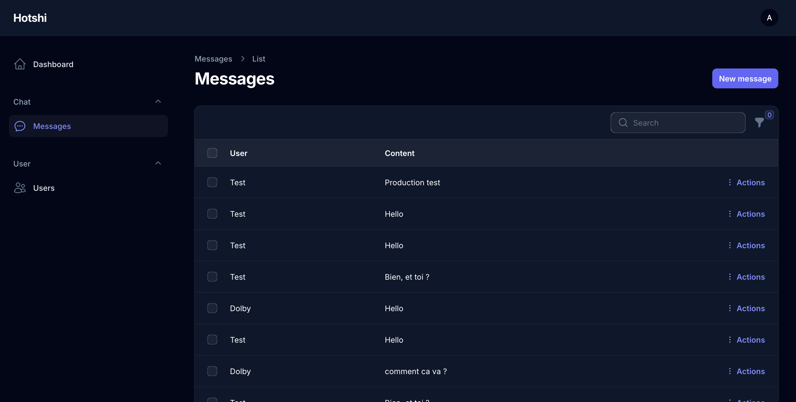

## Hotshi test backend

Backend pour le test d'application de chat mobile

## Install composer dependencies

- composer install
- php artisan db:seed --class=InitSeeder
- php artisan install:broadcasting
- add pusher credential in .env
- php artisan serve

## Live demo
- [Live demo](https://test.elikkia.com).
- [Api doc](https://test.elikkia.com/docs/api).

Login mail: claude@gmail.com /
password: claude

